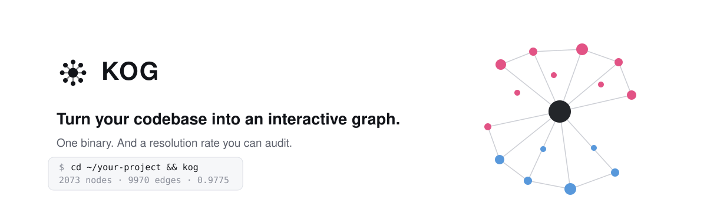

<p align="center">
  <a href="https://github.com/kog-hq/kog">
    <picture>
      <source media="(prefers-color-scheme: dark)" srcset="./assets/logo-dark.svg" />
      <source media="(prefers-color-scheme: light)" srcset="./assets/logo.svg" />
      
    </picture>
  </a>
</p>

<h2 align="center">Every tool draws your codebase. KOG tells you what it missed.</h2>

<p align="center"><a href="./docs/design/v0-design.md"> Design</a> · <a href="./ROADMAP.md"> Roadmap</a> · <a href="./docs/measurements/"> Measurements</a></p>

<p align="center">
  <picture>
    <source media="(prefers-color-scheme: dark)" srcset="./assets/cover-dark.svg" />
    <source media="(prefers-color-scheme: light)" srcset="./assets/cover-light.svg" />
    
  </picture>
</p>

<br />

> [!NOTE]
> **v0.3.** Twenty-one languages, file-level granularity, and an MCP server so an
> agent can ask the graph instead of grepping. Measured on eleven public
> repositories — one per language — because a language that has never met real code
> does not have a rate, it has a passing unit test. That corpus is what found a Go
> resolver at 0.1261 and a coverage figure overstated by 29 points.

<br />

# Why KOG

A dependency graph is easy to draw and easy to get wrong, and a wrong one is worse than
none — it looks authoritative while quietly omitting edges.

Take the most-depended-upon file in [documenso](https://github.com/documenso/documenso),
`packages/prisma/index.ts`. Ask an agent, or yourself, *what depends on this?* The obvious
move is to grep for its path:

```bash
rg -l "packages/prisma/index" -g '*.ts' -g '*.tsx'   # 0 files
rg -l "@documenso/prisma"     -g '*.ts' -g '*.tsx'   # 476 files
```

Not one import names the path. All 476 go through the workspace package name, and grep
cannot connect the two. The graph finds 484 edges into that file; the obvious answer finds
none, and nothing says so.

Resolving it means reading the root `package.json` `workspaces`, finding the package that
declares that name, and following its `types` entry to source rather than its `main` entry
into `dist/`.

KOG does that, along with `tsconfig` `paths` across `extends` chains — and then reports,
specifier by specifier, everything it still could not resolve.

And it does the equivalent in every other language it reads: a Go import that names a
package directory, a Rust `use` path that ends in a struct rather than a module, a Sass
`@use "buttons"` whose file is `_buttons.scss`, a shell `source "$(dirname "$0")/lib.sh"`.

<br />

# Installation

###  Install the binary

```bash
curl --proto '=https' --tlsv1.2 -LsSf https://github.com/kog-hq/kog/releases/latest/download/kog-cli-installer.sh | sh
```

Windows, from PowerShell:

```powershell
powershell -ExecutionPolicy Bypass -c "irm https://github.com/kog-hq/kog/releases/latest/download/kog-cli-installer.ps1 | iex"
```

macOS and Linux on both Intel and Apple/ARM, Windows on x86-64. No Rust toolchain, no JS
toolchain, no checkout: the page is inside the binary. Every release also carries the
plain archives and a `sha256.sum`, if you would rather not pipe a script into a shell —
and the [releases page](https://github.com/kog-hq/kog/releases) lists them all.

`kog` is not on crates.io, and that is a fact about the binary rather than an omission:
it embeds a built web page that lives outside the crate, so what `cargo publish` uploads
could not build. The prebuilt binary is the install path.

###  Or build it

```bash
git clone https://github.com/kog-hq/kog
cd kog
just install
```

Builds the page, then the CLI that embeds it, then installs `kog` to `~/.cargo/bin`.
Needs Rust and [bun](https://bun.com). No `just`? The [`justfile`](justfile) shows the two
commands it runs.

###  Run it

```bash
cd ~/your-project
kog
```

Scans the current directory, serves the graph from a page embedded in the binary, opens
your browser. Nothing is written to your project.

Point it at a directory that merely *contains* projects — `~/work`, a services folder, a
directory of clones — and you get one graph per project rather than one shape drawn out
of codebases that share no imports. A monorepo stays one project: its workspace packages
only resolve from the root.

```bash
kog view ~/other      # view a different project
kog scan              # stats to stdout, writes nothing
kog scan -o g.json    # write the graph as JSON
```

Hand it to a graph tool instead, each behind its own flag and none of them a default —
a scan that wrote four files because you ran it is a scan you stop running:

```bash
kog scan --graphml g.graphml   # Gephi, yEd, Cytoscape
kog scan --cypher g.cypher     # cat g.cypher | cypher-shell -u neo4j
kog scan --yaml g.yaml         # the same record as the JSON
kog scan --markdown report.md  # the numbers, as a report you can paste into a PR
kog scan --obsidian vault/     # an Obsidian vault: one wikilinked note per file
```

The **Obsidian vault** is the one you keep rather than look at: a note per file, with
`[[wikilinks]]` for every import, frontmatter carrying the language, the line count and the
dependent count, and — on the file that wrote them — every import that did *not* resolve.
Obsidian draws its own graph from the links, backlinks answer "what depends on this" on
every note, and search runs over the whole thing.

Everything above is also one click away inside the interface, from the download button
beside the theme toggle. The page asks the binary for those files rather than rebuilding
them in TypeScript: one implementation, and it is the one with tests.

The interface exports the **PNG** — the download button beside the theme toggle saves
exactly what is on screen. The picture comes from the browser because the *layout* does:
KOG's Rust side deliberately draws nothing, since it would need a second layout, that one
would be worse, and two layouts drift. For a PDF, print the Markdown report with any
converter, or print the page from the browser.

The server binds to `127.0.0.1` on an OS-assigned port and prints the URL before opening
anything, so `kog` over SSH still tells you where to look.

<br />

# Ask it

The graph knows which files import `packages/prisma/index.ts`. Ask it rather than grep:

```bash
$ kog query "what depends on packages/prisma/index.ts" --root documenso --limit 3
packages/prisma/index.ts (typescript)
484 dependents
  apps/openpage-api/lib/growth/get-monthly-completed-document.ts
  apps/openpage-api/lib/growth/get-signer-conversion.ts
  apps/openpage-api/lib/growth/get-user-monthly-growth.ts
  … 481 more not shown (raise `limit`)
```

That is the number the section above says grep answers `0` to. Reproduce both against the
pinned commit in [`docs/measurements/`](docs/measurements/).

```bash
kog query "what does apps/web/src/app.tsx depend on"
kog query "blast radius of packages/lib/utils/teams.ts" --depth 2
kog query "files touching react"
kog query "summary"
```

Every list reports its **exact** total and says what it left out, so a capped answer can
never be mistaken for a complete one. A path that names nothing, or names three files, is
told to you rather than guessed at.

###  From an agent

The same five questions are an MCP server over stdio — `scan_summary`, `what_depends_on`,
`what_does_x_depend_on`, `blast_radius`, `files_touching_package`:

```bash
claude mcp add kog -- kog mcp /path/to/your-project
```

Or, for any client that reads a JSON config:

```json
{ "mcpServers": { "kog": { "command": "kog", "args": ["mcp", "/path/to/your-project"] } } }
```

It scans once at startup and answers from memory. Structure, not file contents — so
*"what depends on this?"* costs tens of tokens where reading the 484 files would cost
hundreds of thousands and fit in no context window at all.

The CLI and the MCP server are the same code: one `Atlas`, one set of answers, one
rendering. Two implementations would eventually disagree, and only one of them would be
measured.

**Check it works before wiring anything up.** The server is newline-delimited JSON-RPC on
stdin and stdout, so a pipe is a complete client:

```bash
printf '%s\n' \
  '{"jsonrpc":"2.0","id":1,"method":"initialize","params":{"protocolVersion":"2025-06-18","capabilities":{}}}' \
  '{"jsonrpc":"2.0","id":2,"method":"tools/call","params":{"name":"scan_summary","arguments":{}}}' \
  | kog mcp . | jq -r 'select(.id==2) | .result.content[0].text'
```

Progress goes to stderr and protocol messages to stdout, so that pipe stays clean. Swap
`scan_summary` for `what_depends_on` with `{"path": "src/index.ts"}` to ask a real
question. Once it answers there, it will answer from any client.

<br />

# Two numbers, and how to check them

A resolution rate answers *of the imports I read, how many resolved?* It says nothing
about the files never read at all — a tool that supports one language and silently drops
the other nine scores a perfect rate on a polyglot repository.

So every scan publishes both.

```
resolution rate = resolved / (internal − excluded)
source coverage = analysed / (analysed + unsupported)
```

Externals leave the resolution rate's denominator — `import react` has no file to point
at. So do **excluded** specifiers: those resolved to a real path outside the scanned set,
which is a policy decision, not a parser failure. Documentation, data and images leave
the coverage denominator for the same reason: a repository is not worse mapped for
containing a README.

Measured on eleven public repositories, each pinned to a commit you can check out
yourself — one per language KOG claims, because a language that has never met real code
does not have a rate, it has a passing unit test. Full evidence, including the commits:
[`docs/measurements/`](docs/measurements/).

| Repository | Language | Files seen | Analysed | Not read | Source coverage | Resolution rate |
| --- | --- | ---: | ---: | ---: | ---: | ---: |
| [withastro/docs](https://github.com/withastro/docs) | Astro, MDX | 2,941 | 2,701 | 0 | **1.0000** | **0.9975** |
| [cli/cli](https://github.com/cli/cli) | Go | 1,338 | 927 | 8 | **0.9914** | **1.0000** |
| [curl/curl](https://github.com/curl/curl) | C | 4,437 | 1,097 | 152 | **0.8783** | **0.9705** |
| [JamesNK/Newtonsoft.Json](https://github.com/JamesNK/Newtonsoft.Json) | C# | 988 | 945 | 0 | **1.0000** | **1.0000** |
| [google/gson](https://github.com/google/gson) | Java | 314 | 264 | 4 | **0.9851** | **1.0000** |
| [pallets/flask](https://github.com/pallets/flask) | Python | 236 | 106 | 4 | **0.9636** | **0.9970** |
| [BurntSushi/ripgrep](https://github.com/BurntSushi/ripgrep) | Rust | 236 | 114 | 2 | **0.9828** | **0.9734** |
| [sinatra/sinatra](https://github.com/sinatra/sinatra) | Ruby | 292 | 155 | 76 | **0.6710** | **1.0000** |
| [slimphp/Slim](https://github.com/slimphp/Slim) | PHP | 145 | 125 | 0 | **1.0000** | **0.9807** |
| [fmtlib/fmt](https://github.com/fmtlib/fmt) | C++ | 142 | 79 | 5 | **0.9405** | **0.8571** |
| [documenso/documenso](https://github.com/documenso/documenso) | TypeScript | 2,833 | 2,243 | 164 | **0.9319** | **0.9779** |

Broadening that corpus from two repositories to eleven immediately found a resolver
publishing **0.1261**: on `cli/cli`, Go resolved 432 of 3,427 of its own imports, because
the repository ships a CodeQL fixture whose `go.mod` repeats the real module line and the
resolver picked the wrong one. It now resolves all 3,427. That is the argument for
measuring per language, made against this tool rather than by it.

And a rate per language, because an aggregate lets a broken resolver hide behind a
majority language that works. On TanStack/query:

| Language | Files | Rate | | Language | Files | Rate |
| --- | ---: | ---: | --- | --- | ---: | ---: |
| typescript | 943 | 0.9948 | | html | 77 | 0.9444 |
| javascript | 138 | 0.9333 | | vue | 20 | 1.0000 |
| svelte | 77 | 1.0000 | | astro | 2 | 1.0000 |

That table is the argument for publishing per language rather than one number: writing
it turned up two real resolution bugs — `.d.ts` never probed, and SvelteKit's
`%sveltekit.assets%` placeholder treated as a path — that moved the repository-wide rate
by less than a point while breaking Vue outright.

Nothing is hidden. Every specifier that did not become an edge is listed in
`stats.diagnostics` with its file, its line, its language and **why** — `not_found`,
`gitignored`, `skipped_directory`, `outside_root`, `target_unreadable`. Every file no
extractor could read is named, by extension and language, in `stats.coverage`.

```bash
git clone --depth 1 https://github.com/documenso/documenso
kog scan documenso -o graph.json

# why did specifiers fail?
jq '[.projects[0].graph.stats.diagnostics[].reason] | group_by(.)
    | map({reason: .[0], count: length})' graph.json

# which languages were not read at all?
jq '.projects[0].graph.stats.coverage.extensions[]
    | select(.status == "unsupported_language")' graph.json
```

Full breakdown, with the raw output and every gap categorised, in
[`docs/measurements/`](docs/measurements/).

#  What it does not do

Stated plainly, because a tool that only advertises its strengths is not measuring anything.

- **Twenty-one languages, not all of them.** TypeScript, JavaScript, Vue, Svelte, Astro, MDX, Go,
  Python, Rust, C, C++, Java, C#, Ruby, PHP, HTML, CSS, Sass, Less, Stylus and
  shell.
  Everything else is a node in the graph and a named line in the coverage report — SQL,
  Swift, Kotlin, Scala, Elixir, and every template language — but its own imports are not
  read. The report says which, and how many. That count is derived from the registry by a
  test, not written by hand: it had drifted to "sixteen" and nothing caught it.
- **C and C++ do not read CMake or Automake.** An include directory declared with
  `target_include_directories` or `AM_CPPFLAGS` is invisible, so a header that is really
  in the repository can still read as missing — `curl` includes its own
  `tests/libtest/unitcheck.h` 85 times that way. C sits at 0.9693 and C++ at 0.8986:
  honest about what KOG can see, an understatement of what the compiler can.
- **SQL is deliberately not read.** All 163 `.sql` files on documenso are Prisma
  migrations, and migrations do not reference one another: 0 psql includes, 0 files
  naming another. An extractor would add 163 nodes with no edges and move source coverage
  five points without adding a single piece of information.
- **Files, not symbols.** Nodes are files, edges are static imports. Call graphs need a
  type checker to be right, and a wrong call graph is worse than a coarse import graph.
- **No dynamic `import()`**, no `require()`, no run-time path assembly. A shell `source
  "$CONFIG"` is reported as undecidable rather than broken.
- **A Go import is a package**, so one specifier becomes an edge to every file in that
  directory. That is what a file-level graph of Go means, not a bug.
- **The interface is early.** It searches, filters, clusters and inspects, and it holds
  2,800 nodes interactively — but it is one window built ahead of the desktop shell it is
  meant to become, not a finished product.
- **`files touching X` means an *external* package.** A workspace package or a path alias
  resolves to a file, so `@documenso/prisma` answers zero there while 484 files import it.
  The answer says which index it searched and points at the query that does work, rather
  than reporting a zero that reads like a fact about the repository.
- **A scan is a snapshot.** `kog mcp` reads the tree once at startup; edits after that are
  invisible until it is restarted.
- **Eleven repositories is not a corpus either.** It is one project per language, chosen
  by the author of the tool. Better than two; still not a sample.

# Stack

Rust, [tree-sitter](https://tree-sitter.github.io) for parsing — one grammar per
language, one `Extractor` implementation each, dispatched by extension — and no LLM
anywhere in the pipeline: resolution is deterministic or it is not reported. The page is
[sigma.js](https://www.sigmajs.org) and [graphology](https://graphology.github.io) on WebGL,
built with Vite and embedded in the binary at compile time.

<br />

# Project status

v0.1 and v0.3 are complete and measured: twenty-one languages, and an MCP server so an
agent asks the graph instead of grepping. [`ROADMAP.md`](ROADMAP.md) has what is left — the
languages the coverage report keeps naming, packaging, then a desktop shell.

Contributions welcome — [`.github/CONTRIBUTING.md`](.github/CONTRIBUTING.md).

<br />

# License

Dual-licensed under [MIT](LICENSE-MIT) or [Apache 2.0](LICENSE-APACHE), at your option.
